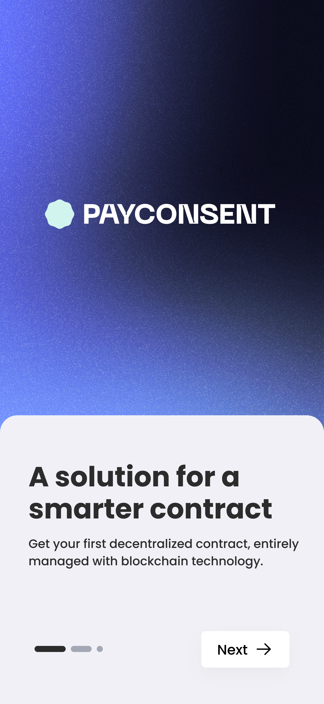
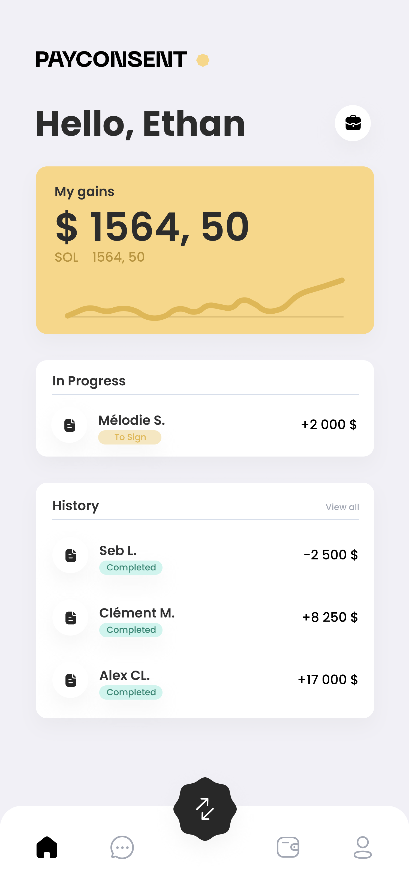

# PBW_Hackathon_2023

  
  

This project was created for the 2023 Paris Blockchain Week Hackathon.

## 🤏 Pitch
#### Where does the idea of payconsent come from ?
Actually, we, as newly freelance devs, have been experiencing issues with a client payment. Even to this day we did not receive the money. 
We wanted to solve this problem using Blockchain technology.
And that’s how we thought about Payconsent.

## 📔 Summary

 - ❗ Problem
 - ✅ Solution
 - ⚙️ How to run the project ?

## ❗ Problem
#### What problem does your project solve? 
1. Contract falsification  
2. Deadline for payment not respected  
3. Terms of contract not respected  
  
#### How does it fit into the theme "Building a Decentralized Future"?  
The solution is independant, self governing.  
    
## ✅ Solution
#### How did you resolve this issue?  
1. We decided to solve this issue, by creating an easy to use and decentralized payement protocol service that protect the 2 users during transaction (service-for-money).  
2. For each mission, we create a unique smart contract that is not editable and not replicable.  

  
It is a simply-to-use contract creator tool that allows any users to create their own traditional contract, but…. directly on blockchain !  
  
We create a climate of trust for every users (Open Trust Framework Model).  
  
#### What technologies did you use?
- Solana blockchain
- Anchor framework
- ReactJS 
- Figma to design and prototype the website

## ⚙️ How to run the project ? 
  
Clone the repository:  
`https://github.com/ethan0905/PBW_Hackathon_2023`  

### Frontend

1. `cd app`
2. `npm install`
3. `npm start`

### Backend

The smart contract was deployed on the Solana testnet. The public adddress of the program is `GR4kCNvK9Wvasg5H11JpWp5dqUyJwVYH9K5RJHkxnjG2`